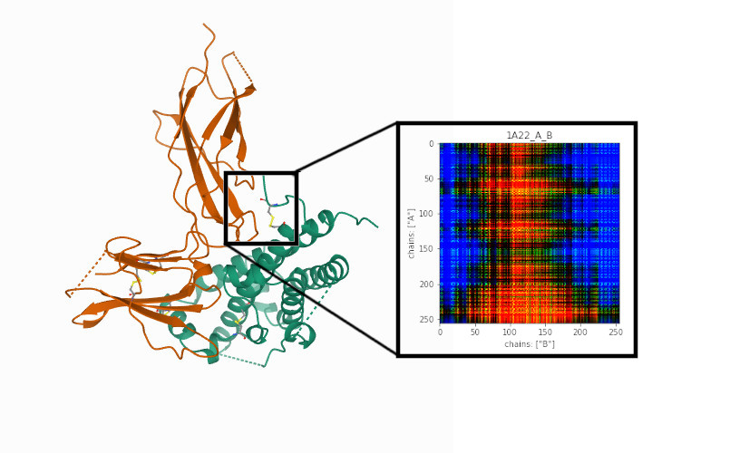

# Protein-Protein Interactions

The objective of this project is to reliably predict the relative binding affinity arising due to mutations in protein structures, which is an active field of research in protein engineering.



We are using the [SKEMPI v2.0](https://life.bsc.es/pid/skempi2/) dataset, which provides pairs of proteins in [PDB format](https://en.wikipedia.org/wiki/Protein_Data_Bank_(file_format)) (wild-types) and specifies the mutations that should be performed onto them, giving as well values to calculate the change in binding affinity between the wild-type and the mutant.

## File Structure

1. `data`: This directory contains all the data required for training and validation. The data comes from the [SKEMPI v2.0 website](https://life.bsc.es/pid/skempi2/). We provide the dataset required in this repo, so you do not need to download anything.

    - `pdbs_wt/`: This directory contains the PDB files corresponding to the wild type complexes.

    - `pdbs_mut/`: This directory contains the PDB files corresponding to mutants of the complexes in `pdbs_wt/`. The mutants are generated by applying random missense or multiple mutations following the SKEMPI dataset.

    - `skempi_v2_cleaned.csv`: This CSV file contains information about the PDB complexes in a more readable format.

    - `extracted_features.csv`: This CSV file contains the extracted features from the feature matrices generated by `preprocessing.py`. 

2. `scripts`: This directory contains all the Python scripts used for data acquisition, preprocessing, training and validation. 

    - `constants.py`: It contains a list of all the common constant values used by rest of the scripts.

    - `pdb_pipeline.py`: It cleans and generates the features required for the models using OpenMM for simulation.

    - `preprocessing.py`: It preprocesses the features generated by `pdb_pipeline.py` and generates a CSV for usage by `mlp.py` and `tune_xgboost.py`.

    - `mlp.py`: It implements the MLP model approach.

    - `tune_xgboost.py`: It implements the XGBoost model approach.

    - `hydranet.py`: It implements the HydraNet model approach.

    - `utilities.py`: It contains simple utility functions which are used by rest of the scripts.

    - `train_helpers.py`: It contains the common functions used for training in the different models.

3. `notebooks`: This directory contains all the Jupyter Notebooks used for exploring the dataset and potential machine learning parameters. 

    - `data_exploration.ipynb`: It is used for visualising and exploring the dataset for this project.
    - `model_exploration.ipynb`: It is used for data preprocessing targetted towards the MLP and XGBoost models.  

## External Libraries

The following are the main external libraries used in this project:
- [numpy](https://numpy.org/)
- [matplotlib](https://matplotlib.org/)
- [pytorch](https://pytorch.org/)
- [bayesian-optemization](https://github.com/fmfn/BayesianOptimization)
- [xgboost](https://xgboost.readthedocs.io/en/latest/python/python_intro.html)
- [torchvision](https://pypi.org/project/torchvision/)
- [scikit-learn](https://scikit-learn.org/stable/)
- [scikit-image](https://scikit-image.org/)
- [openmm](http://openmm.org/)
- [pdbfixer](https://github.com/openmm/pdbfixer)
- [tqdm](https://github.com/tqdm/tqdm)
- [pymol-bundle](https://pymol.org/2/)
- [parmed](https://github.com/ParmEd/ParmEd)
- [munch](https://github.com/Infinidat/munch)


## Requirements

* Anaconda or [Miniconda](https://docs.conda.io/en/latest/miniconda.html) (latter takes less time to install) as your python distribution.

> **Note**: due to the `pdbfixer` and `openmm` packages, this project is running on Python 3.7.

> **Note**: having an Nvidia GPU available is highly recommended, although not necessary.

## Installation

Install the env with the following command:
```
conda env create -f environment.yml
```

Now activate the conda environment by typing (note that you need conda to be active in your shell):
```
conda activate ml_protein_protein
```

If you need to update the environment use:
```
conda env update -f environment.yml
```

If for whatever reason you need to delete the environment due to conflicts, you can run:
```
conda env remove -n ml_protein_protein
```

Thereafter you have to run `conda deactivate` and you will be able to reinstall everything properly. 

> A `Makefile` already provides these commands for faster access. Simply run `make install-env`.

## Running the notebooks

Some Jupyter notebooks are provided under `notebooks/`, you can view them by running:

```bash
conda activate ml_protein_protein
jupyter-notebook notebooks
```

From the project root directory.

## Executing the scripts

In order to execute the Python scripts for data generation, preprocessing and to train the models you need to be in the `scripts/` folder. From the root of the project:

```bash
cd scripts/
```

Then, to train the models you first need to generate the features:

```bash
conda activate ml_protein_protein
python pdb_pipeline.py
python preprocessing.py
```

Finally, you can train the different models:

```bash
python mlp.py
python tune_xgboost.py
python hydranet.py
```

The results will be shown in standard output and will be stored in a log file inside a newly created directory.
